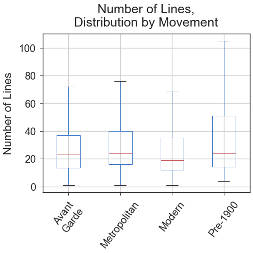
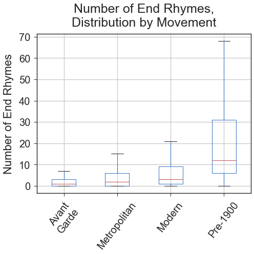
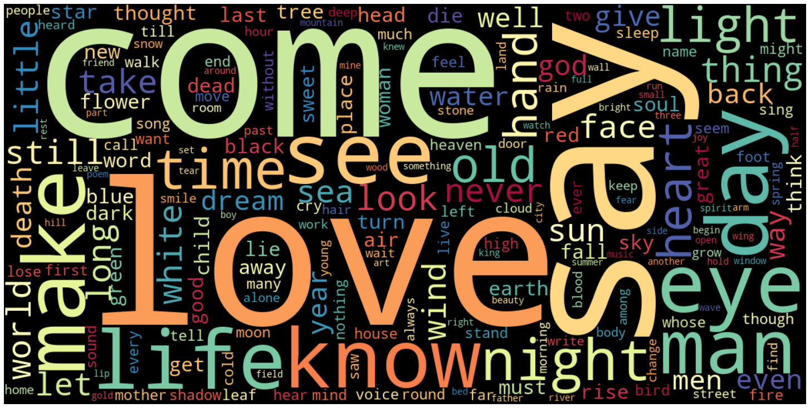

# Predicting Poetic Movements

After scraping [Poetry Foundation](https://www.poetryfoundation.org/) for poems within certain genres, I perform natural language processing (NLP) techniques to analyze the characteristics and word usage of four self-determined poetic movements: pre-1900 (Victorian and Romantic), Modern (a standalone category), Metropolitan (New York School [1st and 2nd Generation], Confessional, Beat, Harlem Renaissance, Black Arts Movement), and Avant-Garde (Imagist, Black Mountain, Language Poetry, Objectivist). Through text processing, feature engineering, and exploratory data analysis, I discover insights into how important words and structure relate to genre. I then create predictive models to provide further insight and confirm my findings during EDA. Finally, using Gensim's Doc2Vec, I created a [poetry recommendation system](https://evening-cove-11137.herokuapp.com/), which includes a lot of my engineered features in an optional filter.

## To use the app locally, run:
```streamlit run app.py```

## Findings and future considerations
- Pre-1900 poetry is easily recognized.
    - High number of end rhymes, most words per line, and simpler words (fewer syllables per word).
- Avant-garde is the polar opposite.
    - Practically no end rhymes, fewest words per line, and more complex words (more syllables per word).
- Poetry is rarely neutral (and generally positive) and fairly equally subjective/objective.
- Lots of visual and temporal vocabulary.
- Form/structure is important for prediction (especially Random Forest models).
    - Further exploration desired:
        - Other types of rhyme
        - Use of line breaks, tabs, and spacing
        - Topic modeling
- SVM relies mostly on vocabulary.
    - Further exploration desired:
        - Word embeddings (self-trained and pre-trained)
        - POS tagging

- Some of the words that the SVM model weighed the heaviest were surprising, given that they were mostly not among the top words overall:
    - crazy
    - among
    - nobody
    - form
    - look
    - dream
    - small
    - cry
    - star

## 10 most common words after removing stopwords (# of appearances):
    'love'  (2,996)
    'say'   (2,528)
    'day'   (2,345)
    'see'   (2,275)
    'make'  (2,260)
    'eye'   (2,091)
    'know'  (2,013)
    'night' (1,977)
    'life'  (1,975)
    'man'   (1,911)

## Most prevalent features in the Random Forest model: (in order of magnitude)
    End rhymes (total)
    Words per line (average)
    Syllables per word (average)
    Lines (total)
    Polarity score
    Subjectivity score
    'heart'
    'get'
    'day'
    'sweet'

## 10 most important features in the SVM model: (in order of magnitude)
    crazy
    among
    nobody
    form
    look
    Words per line (average)
    dream
    small
    cry
    star

# Conclusion
Creating and analyzing numerical features of poetic form and structure proved fruitful for most models in terms of classifying which movement a poem belonged to. They were not very helpful, however, for the best model, which used SVM. This model seemed mostly to use lower frequency words. With more time, I would like to explore training word embeddings and using pre-trained word embeddings with LSTM and CNN neural networks. My next steps include building a recommendation system using these results, as well as generating some poetry based on each movement. To make a truly good recommendation system, however, one would need to be able to build a model around specific genres, rather than an umbrella genre. Still, one may be able to use these umbrella genres as a top layer, then move within that to take a closer look at the individual genres it contains.

## List of files
- **.gitignore** - list of files and pathways to ignore
- **01_webscraping_notebook.ipynb** - notebook of scraping, compiling, and cleaning my datasets and corpus
- **02_eda_processing_feature_engineering.ipynb** - notebook with feature engineering, EDA, text processing, and chart/visualization creations
- **03_modeling_notebook.ipynb** - notebook with Naive Bayes, Decision Tree, Random Forest, and SVM models
- **04_recommendation_system.ipynb** - notebook with Doc2Vec model training and function building
- **app.py** - file with app layout
- **functions.py** - file with functions used in feature engineering, EDA, modeling, and visualizations for this project
- **functions_app.py** - file with functions in app
- **functions_rec_tests.py** - file used for building functions for testing in jupyter notebook
- **functions_webscraping.py** - file with functions used in webscraping and data cleaning
- **presentation.pdf** - slides for my presentation of this project
- **presentation_including_app.pdf** - updated slides for my presentation of this project including an app demo
- **README.md** - this very file!
- **Procfile** - requirement for Heroku deploy
- **requirements.txt** - requirement for Heroku deploy
- **setup.sh** - requirement for Heroku deploy
- **archives** folder - old jupyter notebooks, mostly scrap
- **charts** folder - charts and visualizations created during the project
- **data** folder - datasets, corpora, and models
<!-- - **03_modeling_notebook-ALL-GENRES.ipynb** - *WORK-IN-PROGRESS!* experimenting with using all genres
- **03_modeling_notebook-ALL-GENRES-downsampling.ipynb** - *WORK-IN-PROGRESS!* experimenting with using all genres plus downsampling -->

## Important Visualizations

### Average Line Length (by genre):


### Number of Lines (by genre):


### Average Number of Syllables per Word (by genre):


### Number of End Rhymes (by genre):


### Presence of End Rhymes (by genre):


### Polarity (by genre):


### Top 25 Words by Frequency (overall):


### Top 25 Words by Frequency (by genre):


### Word Cloud (overall):


### Word Cloud (by genre):


### Random Forest Confusion Matrix:


### SVM Confusion Matrix:


# [PO-REC](https://evening-cove-11137.herokuapp.com/) - poetry recommendation app


## BLOG POST FORTHCOMING