# Predicting Poetic Movements

### *NOTE (as of 08/25/2020): I'm currently working on improving this project using more accurately scraped poems. I'm also re-organizing the notebooks, so the modeling and recommendation system notebooks are not currently up to the usual standard.*

### *The app is still useable (and highly, shall we say, recommended). Finally, the conclusions are shaping up to be very similar to what is included in this ReadMe (which will also be revamped).*

### Thanks for understanding :) Without further ado:

## Summary
After scraping [Poetry Foundation](https://www.poetryfoundation.org/) for poems within certain genres, I use natural language processing (NLP) techniques to analyze the form, structure, and word usage of four poetic movements: pre-1900 (Victorian and Romantic), Modern (a standalone category), Metropolitan (New York School [1st and 2nd Generation], Confessional, Beat, Harlem Renaissance, Black Arts Movement), and Avant-Garde (Imagist, Black Mountain, Language Poetry, Objectivist).

Through text processing, feature engineering, and exploratory data analysis, I discover insights into how form and structure relate to poetic movements. I then create predictive models to provide further insight and confirm my findings during EDA. 

Finally, using Gensim's Doc2Vec, I create a [poetry recommendation system](https://evening-cove-11137.herokuapp.com/), which includes many of my engineered features as optional filter methods.

## To use the app locally, run (after cloning the repo):
```streamlit run app.py```

## Objectives
1. Engineer features to investigate form and structure of poems across each movement.
2. Explore any meaningful differences in language between the different movements.
3. Build a classification model to discover whether form and structure (and any meaningful language) play a significant role in identifying a poem's movement.
4. Create a recommendation system to find similar poems to words, phrases, and other poems based on my model.

## Findings

### 1. Feature engineering
#### Number of lines
- Although the median values are all fairly similar (except for Modern poetry), Pre-1900 poems tend to be much longer on average. The average length is 55 lines, whereas the next highest, Metropolitan, is only 38. The distribution of the upper quartiles in the chart below further depicts a movement that's no stranger to a long poem.

- The lower whisker for Pre-1900 also shows that those poems tend to be *at least* a few lines long (the minimum was 4), whereas the other movements have no problems with a one-line poem.

- Modern poetry tends to be the shortest with the lowest average (33 lines) and a median that is 4 lines fewer than the next lowest.


<br/><br/>

#### Average line length (words per line)
- While the existence of prose poetry (poetry written more in paragraph form without many or any line breaks) in Avant-Garde, Metropolitan, and Modern poetry skews their averages, the median values tell a different story.
    - Avant-Garde has the fewest words per line by far, with a median value of about 5.1 words, compared to the next lowest, Metropolitan, at about 6.6 words.
    - Pre-1900 poetry tends to have the longest lines, with a median value of 7.0 words, and also tends to be the most regular, with the smallest range of values. This makes sense given the adherence to established structures such as sonnets.
    - It is also worth noting that Pre-1900 poetry has the smallest average value, which is again due to there being no examples of prose poetry.

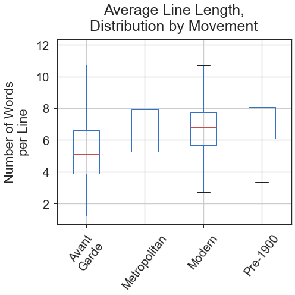
<br/><br/>

#### Polarity
- Pre-1900 poetry is overwhelmingly positive, with a median value of .90! Notice the position of the red line compared to the other movements in the chart below.
- The other three movements are all very similar to each other, and their polarities have no statistically significant differences between them.

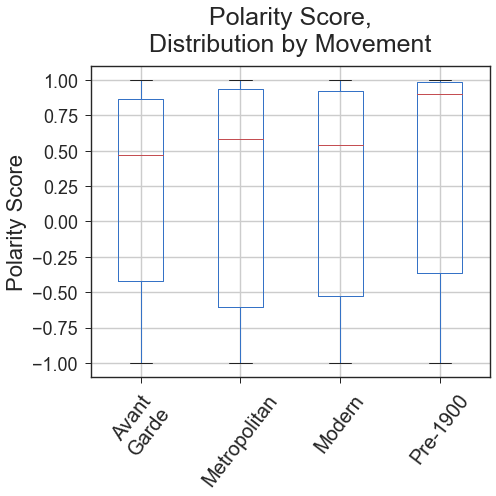
<br/><br/>

- Poetry is rarely neutral and tends to be positive; at least 60% of the poems in each movement have a positive polarity score.
    - 70% of Pre-1900 poems have a positive polarity score.
- Avant-Garde poetry contains the most neutral poems, but it's still a relatively small share.

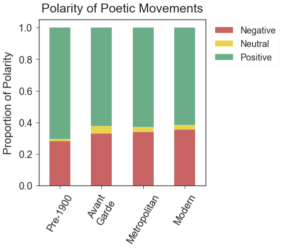
<br/><br/>

#### End rhymes
- One of my model's best features is the ratio of end rhymes (words at the end of a line that rhyme with other words at the end of a line) to the total number of lines.
- Unsurprisingly, there is a lot of separation between Pre-1900 poetry and the other movements.

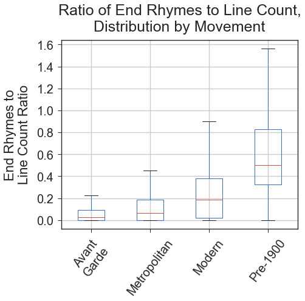
<br/><br/>

- Avant-Garde poetry tends not to use end rhymes, and they are relatively infrequent in Metropolitan poetry.

- End rhymes are not uncommon in Modern poetry, but they are truly at home in Pre-1900 poetry (and almost a requirement).

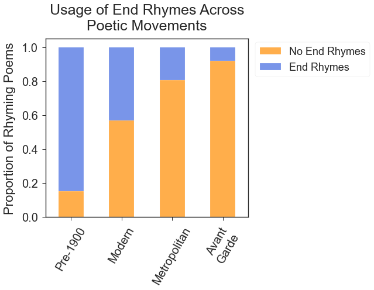
<br/><br/>

#### Complexity of language (syllables per word)
- I had expected Pre-1900 poetry, with its flowery Victorian-era English, to have a much higher average of syllables per word. Instead, it has the least complex word usage (fewest syllables), whereas Metropolitan has the highest median value.

- It's worth noting that Avant-Garde has the largest range by far in the accompanying box-and-whisker plot. This indicates a varied movement of poems that employ simple and complex language. 

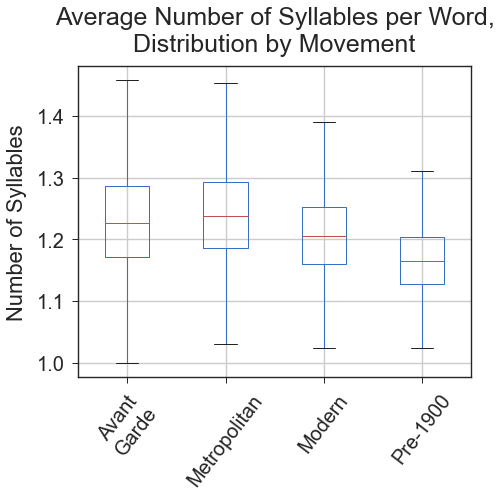
<br/><br/>

#### Lexical richness
- Lexical richness is a measure of the number of unique words divided by the number of total words in a text. A repetitious poem would have a low value, whereas a poem with a high value (almost or entirely unique words) would be described as "lexically rich".

- Pre-1900 poetry appears to be the most repetitious movement, whereas Avant-Garde poetry is the most lexically rich. In the chart below, Avant-Garde is the only movement where a whisker reaches a value of 1.0, and all of it's quartiles are above the other movements.

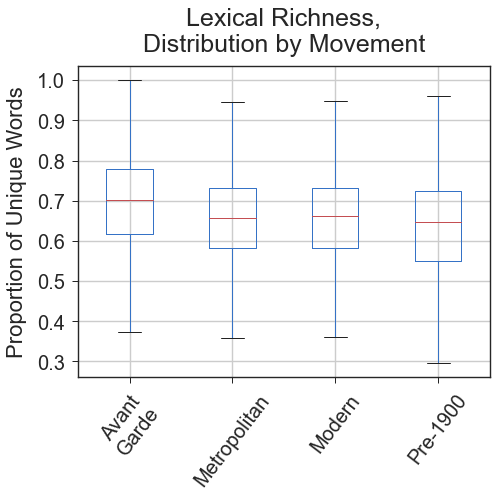
<br/><br/>

### 2. Language use across movements


<br/><br/>

- A lot of **visual** (*see*, *eye*, *light*, *look*, *white*, *face*), **temporal** (*day*, *night*, *time*, *old*, *long*, *never*), and **conceptual** (*love*, *life*, *man*, *heart*, *thing*, *still*, *world*) terms.

- After lemmatization, *come* just barely edged out love for the top spot. This perhaps simultaneously points to a call to action (a beckoning, a la "Come here!"), a passive observation ("He comes from a distant city…", from Diane di Prima's An Exercise in Love), as well as the sexual verb, which is undoubtedly more common in the post-19th Century movements.

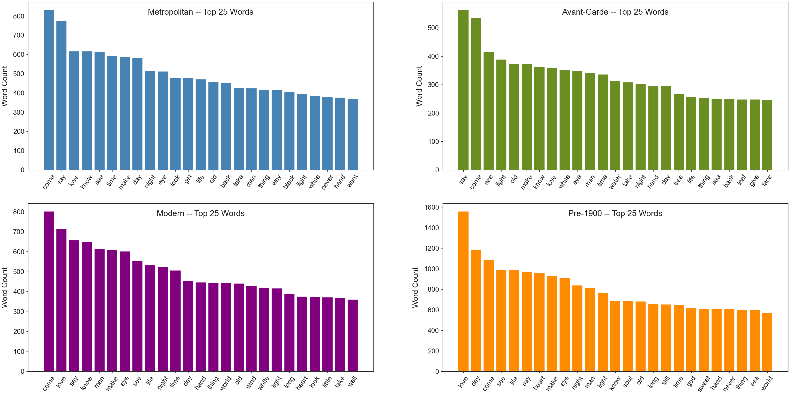
<br/><br/>

- Metropolitan, Modern, and Avant-Garde poetries tend to focus more on the visual and temporal, with Avant-Garde also including some more specifically natural words like *water*, *tree*, *sea*, and *leaf*. 

- It is also worth noting that *love* is only the eighth most popular term for Avant-Garde, whereas it's in the top three of the other movements.

- Pre-1900 poetry skews more conceptual and **ethereal**, with words like *soul* and *god*, which are unique to this movement's top 25.
    - I'm also surprised at the relative lack of natural terms (with the exception of *sea*), considering this movement includes the Romantic genre, which is known for glorifying nature.

- *Black* is unique to Metropolitan's list, which can presumably be explained by the Harlem Renaissance and Black Arts Movement genres, as well as the dark, gritty aesthetic of city-based poetry by Beat and New York School poets.

- Finally, it is worth noting the scale of each of these graphs, which reflects the wordiness and repetition of Pre-1900 poetry and the opposite qualities in Avant-Garde poetry. As has generally been the case in my analyses, Metropolitan and Modern poetries lie somewhere in the middle.

### 3. Modeling

Other than the baseline, my models were consistently better at picking out Pre-1900 poetry, without much confusion between that movement and the other three. Avant-Garde, Metropolitan, and Modern proved more difficult to differentiate and were often confused for each other. The final model seems to suggest that Modern is the closest movement to Pre-1900, with 15% of Modern poems being incorrectly classified as Pre-1900 poems. Avant-Garde and Metropolitan appear very similar to each other, which makes sense from a poetry standpoint.

#### Baseline model
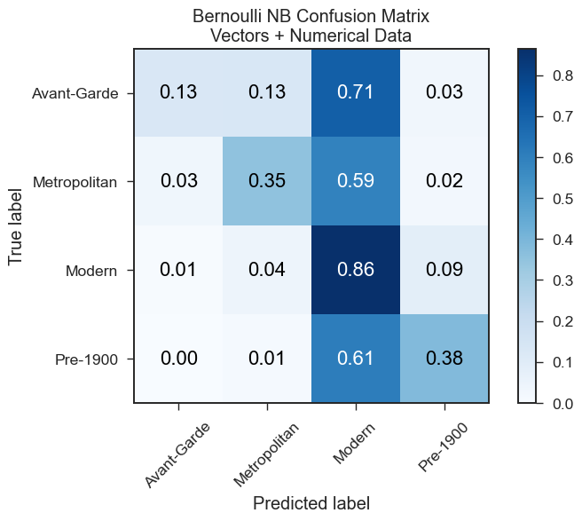
<br/><br/>

- Very much overpredicts on the dominant class.
- Has decent precision when it does stray from predicting Modern.

#### SVM with TF-IDF vectors and engineered features
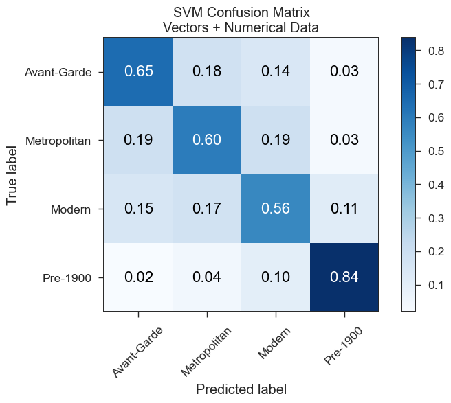
<br/><br/>

- Very overfit (99.9% F1 on training set and 65.5% on testing set) but a good spread of predictions here compared to the other models.
- Each category is correctly predicted at least half the time.
- Pre-1900 poetry is very easily recognized by the model.
    - Modern poetry appears to be the largest confusing factor here, so must share some similarities with Pre-1900 poetry.
    - Avant-Garde and Metropolitan are hardly ever predicted for Pre-1900 poems, and Pre-1900 is hardly predicted for Metropolitan and Avant-Garde poems.

#### SVM (tuned) with Doc2Vec embeddings and engineered features
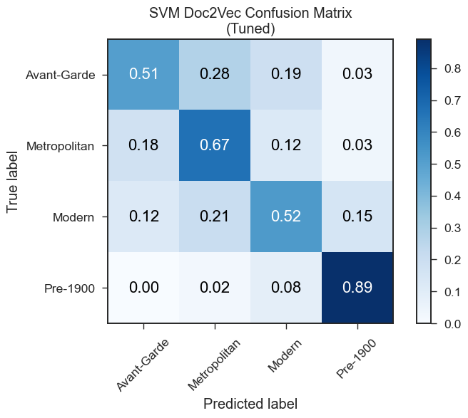
<br/><br/>

- Using Doc2Vec embeddings instead of sparse word vectors greatly simplifies the model and seems to help it generalize better to unseen data. 
    - One of the best fitting models (67.0% F1 on training set and 63.9% on testing set), so it should generalize well on unseen data.
- Every movement still has an accuracy of at least 50%, and an F1 score of at least 55%.
- Pre-1900 remains very easily identified, and Metropolitan performs better than the other two remaining movements.

#### Final model (same as above) trained on all data
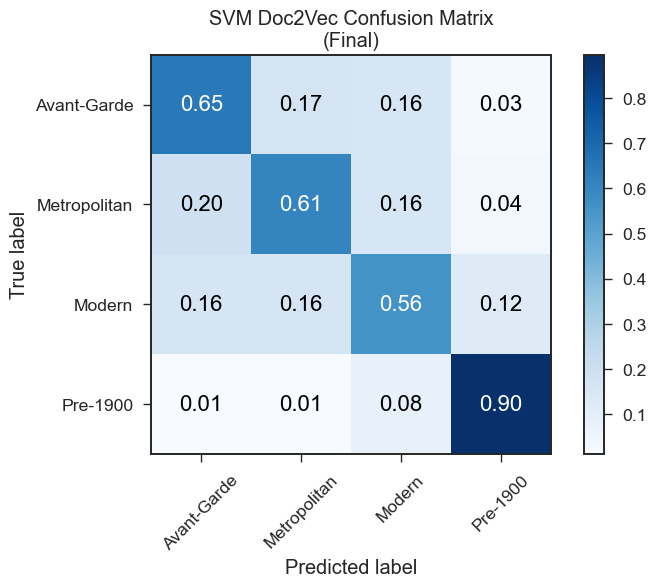
<br/><br/>

- After training on all the data, each category achieves an F1 score of at least 0.60.
    - In the above confusion matrix, each category is correctly identified at least 56% of the time. 
    - Avant-Garde rises in accuracy considerably.

#### Most important features
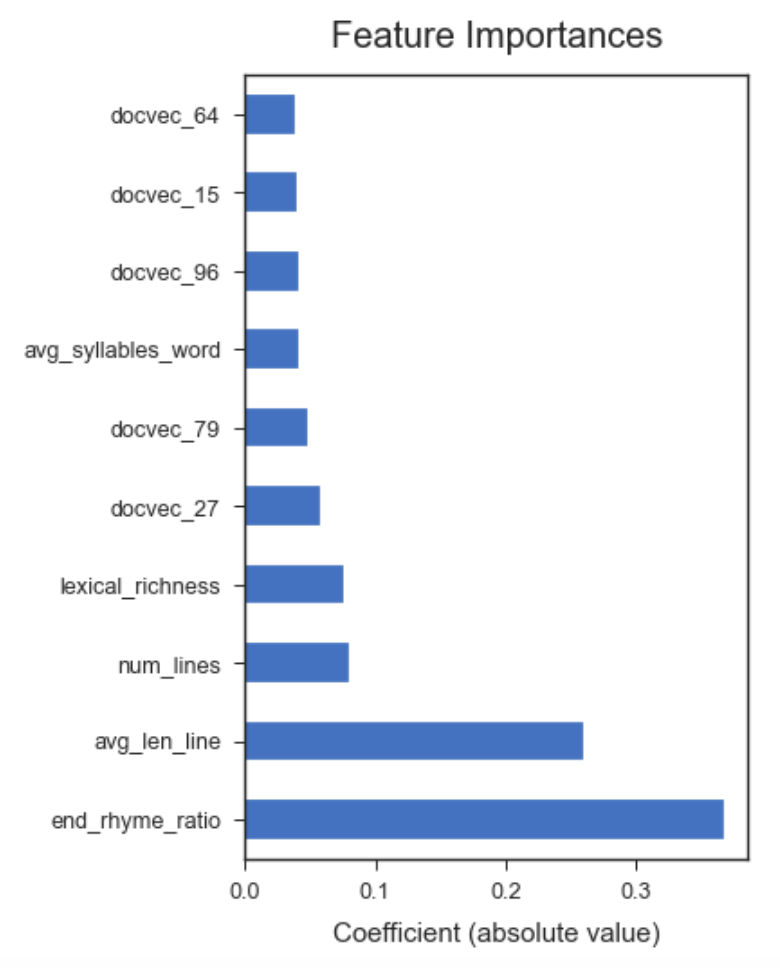
<br/><br/>

- Five out of my seven engineered features make the top ten.
    - The ratio of end rhymes to total lines, average number of words per line, total lines, lexical richness, and average number of syllables per word.
    - Polarity and subjectivity scores did not make the cut.
- The other features are impossible to interpret, being 100 mysterious dimensions created via deep learning.

### 4. Recommendation system

# Conclusions

My main takeaway is that poetry is a unique style of writing, in which form and structure (represented in this project by mostly numerical features) play a fairly significant role in categorizing into movements (and presumably on an even more micro-level into genres). Elements of form, such as the ratio of end rhymes to total lines, proportion of unique words (lexical richness), and the complexity of language (average syllables per word), played an important role in my final model. As did elements of style, such as the length of lines (measured by average words per line) and the length of the poem itself (measured by total lines).

Pre-1900 poetry is easily recognized. It tends to be longer poetry that uses a high number of end rhymes, a lot of words per line, and simpler words (fewer syllables per word). It also tends to be the most repetitious (low lexical richness score).

Avant-garde is the polar opposite. While similar to Metropolitan and Modern in terms of the number of lines, the number of words in a line is by far the lowest overall. It uses practically no end rhymes and tends to use more complex words (more syllables per word). It is also the most lexically rich movement.

Poetry is rarely neutral (and generally positive) and fairly equally subjective/objective. Pre-1900 poetry is overwhelmingly positive.

The vocabulary across movements was a mixture of visual, temporal, and ethereal words. Avant-Garde poetry tends to more frequently use visual and temporal terms (*see*, *light*, *eye*, *old*, *time*) whereas Pre-1900 poetry more often uses ethereal vocabulary (*god*, *heart*, *soul*, *world*). As with most other analyses, Modern and Metropolitan are somewhere in the middle.

## Next steps

In the future, it would be interesting to engineer even more features, such as other types of rhyming (use of internal rhymes or slant rhymes), verb tenses, and use of white space (i.e. whether a poem always starts on the left part of the line). Topic modeling may yield some interesting results as well. 

It may also be interesting to investigate the use of stop words across movements. In my experience in poetry classes, teachers strongly encourage one to use words that make up stop words very sparingly. Perhaps this is more of the influence of Avant-Garde movements on contemporary poetry, or does Avant-Garde poetry reject a long-established rule to use fewer stop words?

Also in the future, I plan on trying to build this out using the actual genres (of which there are 13), as opposed to the four umbrella-like movements that I used in order to explore, visualize, and model more easily. This will present some notable challenges, not least of which is the large class imbalance. Modern poetry, which is its own genre *and* movement, accounts for over a quarter of all the poems.

#### A brief note on modeling
Some endeavors were made into using Word2Vec within the LinearSVC model, as well as combining it with the Doc2Vec vectors. It showed promise but ultimately seemed too complicated without much additional gain. I also tried ensembling several models together, which I cut from this notebook for similar reasons. Finally, I tried an LSTM recurrent neural network model (using pre-trained word embeddings), which tended to only predict Modern and Pre-1900. As always, further tinkering could possibly improve this. Those attempts can be found in this [file](04_modeling-BACKUP_082820-wordvecs_NNs_before_simplifying.ipynb) in the archives.

I also tried an XGBoost model, which achieved a similar F1 score using the Doc2Vec combo data, but was too overfit. Those attempts can be found in this [file](04_modeling-BACKUP_082820-before_removing_xgb.ipynb) in the archives.

## List of files
- **.gitignore** - list of files and pathways to ignore
- **01_webscraping.ipynb** - notebook of scraping and compiling data
- **02_data_cleaning.ipynb** - notebook of cleaning and rescraping poems
- **03_nlp_features_eda.ipynb** - notebook with feature engineering, EDA, text processing, and charts/visualizations
- **04_modeling.ipynb** - notebook with Naive Bayes, KNN, Decision Tree, Random Forest, SVM, and Doc2Vec models
- **05_recommendation_system.ipynb** - notebook with final model training and function building
- **Procfile** - requirement for Heroku deploy
- **README.md** - this very file!
- **app.py** - file with app layout
- **functions.py** - file with functions used in feature engineering, EDA, modeling, and visualizations for this project
- **functions_app.py** - file with functions in app
- **functions_rec_tests.py** - file used for building functions for testing in Jupyter notebook
- **functions_webscraping.py** - file with functions used in webscraping and data cleaning
- **presentation.pdf** - slides for my presentation of this project
- **presentation_including_app.pdf** - updated slides for my presentation of this project including an app demo
- **requirements.txt** - requirement for Heroku deploy
- **setup.sh** - requirement for Heroku deploy
- **archives** folder - old jupyter notebooks, mostly scrap
- **charts** folder - charts and visualizations created in the project
- **data** folder - datasets, corpora, and models
<!-- - **03_modeling_notebook-ALL-GENRES.ipynb** - *WORK-IN-PROGRESS!* experimenting with using all genres
- **03_modeling_notebook-ALL-GENRES-downsampling.ipynb** - *WORK-IN-PROGRESS!* experimenting with using all genres plus downsampling -->

## Check out my [blog post](https://medium.com/@joshua.szymanowski/predicting-poetic-movements-51006847cc6f)

# [PO-REC](https://evening-cove-11137.herokuapp.com/) - poetry recommendation app
